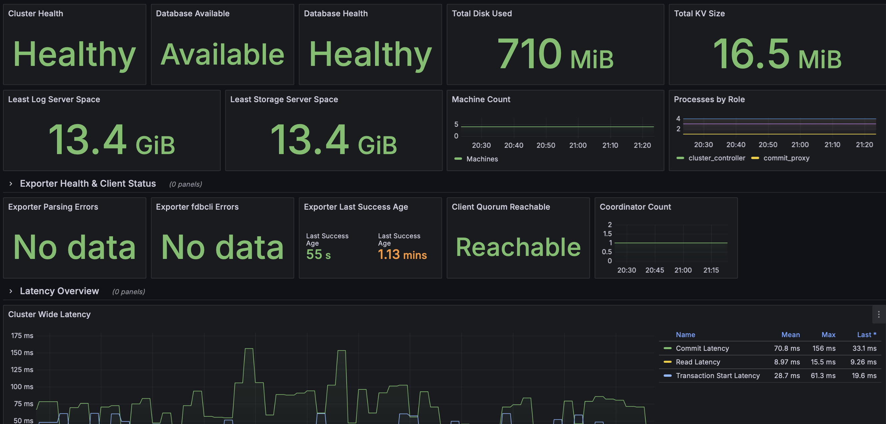
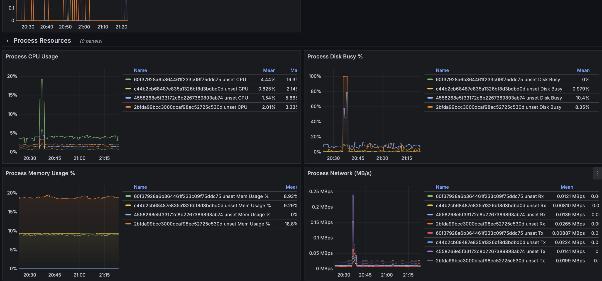

# grafana-dashboard-foundationdb
A Grafana dashboard for FoundationDB, with data via Prometheus.

Use https://github.com/clevercloud/fdbexporter to get data from your fdb cluster, with Prometheus. A Prometheus configuration might look something like this:

```prometheus.yml
  - job_name: 'fdb_exporter'
    fallback_scrape_protocol: PrometheusText0.0.4
    static_configs:
      - targets: ['fdb_exporter:9090']
```



